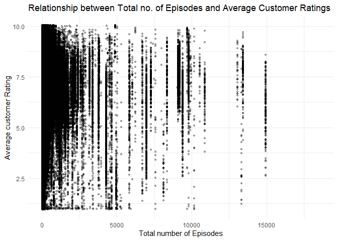
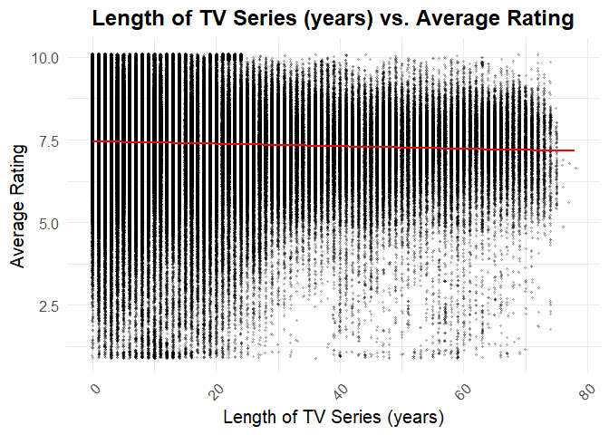

## 1. Research Motivation

The television industry has transformed exceptionally in the past decade
with the advent of streaming platforms like Netflix, HBO, Amazon Prime,
and Hulu, among many others. These platforms have reformed how the
audience consumes content, producing series and shows that allure
millions across the world. The global video streaming market is
projected to grow from USD 674.25 billion in 2024 to USD 2,660.88
billion by 2032, exhibiting a CAGR of 18.7% during the forecast
period.(source: fortune business insights) This dramatic growth poses
the question of what factors contribute to the success (in terms of
average customer rating) of these TV shows. One frequently disputed
factor is the length of the TV shows. While some believe longer TV
series allow for complex storytelling and intricate character
development leading to higher customer engagement and satisfaction
(Mercader, 2023), others may argue that excessive length could cause
viewer fatigue and lower customer satisfaction (Mercader, 2023).
Understanding how the overall length of a TV series influences the
average customer ratings could hold important implications for the
content producers and streaming platforms.Our research aims to indicate the relationship
between the length of the TV series in terms of number of episodes /
number of years the show is running and the average customer ratings. By
establishing this relationship, the question for producers as to whether
more episodes or a new season should be produced, will be made easier.
The producer then has a guideline as to what amount of episodes will
maximize the consumer engagement, and therefore minimize viewer fatigue
which can lead to negative reviews. This led to the formulation of our
research question: How does the length of a TV series influence its
average customers ratings? Additionally,academic researchers in media
and communication studies can use our findings for further analysis to understand the
dynamics of viewer engagement.Our research could be of interest to
psychologists and sociologists studying media consumption
behavior,providing data on how the length of content affects viewer
engagement, satisfaction, and perceived value.Students can replicate our
study in different contexts (eg: TV series in different languages) to
test the variability of our findings.

## 2. Analysis plan

The first step in the analysis plan is data exploration. This step
involves computing summary statistics and visualizations, to obtain 
an idea about the structure of the dataset.Post this,data preparation is done.
The missing observations are imputed or dropped, new variables are engineered wherever
necessary, this ensures that, the dataset is ready for analysis. 
Due to low correlation between the  two independent variables 
total years the series airs and total episodes the series has,
a multiple linear regression model is devised.
The average rating received by the series is the dependent variable 
upon which the regression is performed.The number of votes is used 
as a proxy for popularity of the TV series and is used as the control variable.
The assumptions of linear regression are tested and results are documented.
The key findings from the regression are summarized in the conclusion.


## 3. Data preparation & analysis

### 3.1. Composition of the datasets and description of the variables

#### title.episode.tsv.gz

<table>
<colgroup>
<col style="width: 13%" />
<col style="width: 77%" />
<col style="width: 9%" />
</colgroup>
<thead>
<tr class="header">
<th>Variable</th>
<th>Description</th>
<th>Data Class</th>
</tr>
</thead>
<tbody>
<tr class="odd">
<td><code>tconst</code></td>
<td>An alphanumeric identifier unique to each episode.</td>
<td>String</td>
</tr>
<tr class="even">
<td><code>parentTconst</code></td>
<td>An alphanumeric identifier for the parent TV series of the episode.
It links the episode to the overall series.</td>
<td>String</td>
</tr>
<tr class="odd">
<td><code>seasonNumber</code></td>
<td>The season number that the episode belongs to within the TV
series.</td>
<td>Integer</td>
</tr>
<tr class="even">
<td><code>episodeNumber</code></td>
<td>The specific episode number of the <code>tconst</code> in the TV
series.</td>
<td>Integer</td>
</tr>
</tbody>
</table>

#### title.basics.tsv.gz

<table>
<thead>
<tr class="header">
<th>Variable</th>
<th>Description</th>
<th>Data Class</th>
</tr>
</thead>
<tbody>
<tr class="odd">
<td><code>startYear</code></td>
<td>The year the series began.</td>
<td>Integer</td>
</tr>
<tr class="even">
<td><code>endYear</code></td>
<td>TV Series end year.</td>
<td>Integer</td>
</tr>
</tbody>
</table>

#### title.ratings.tsv.gz

<table>
<colgroup>
<col style="width: 17%" />
<col style="width: 69%" />
<col style="width: 13%" />
</colgroup>
<thead>
<tr class="header">
<th>Variable</th>
<th>Description</th>
<th>Data Class</th>
</tr>
</thead>
<tbody>
<tr class="odd">
<td><code>tconst</code></td>
<td>An alphanumeric unique identifier for each title.</td>
<td>String</td>
</tr>
<tr class="even">
<td><code>averageRating</code></td>
<td>The weighted average of all the individual user ratings.</td>
<td>Numeric</td>
</tr>
</tbody>
</table>

### 3.2. Intial data exploration




#### Inference : 
The graph demonstrates a significant spread of ratings across all episode counts, without any clear pattern or trend.Observations with a low number of episodes are densely populated and exhibit a wide range of ratings, spanning nearly the entire rating scale.As the number of episodes increases beyond 5,000, the density of observations decreases.




#### Inference : 
The scatter plot reveals a relatively uniform spread of average ratings across all series lengths, from shorter series (0–10 years) to longer ones (up to 80 years).


## 4. Conclusion

The analysis findings suggest that both `total_years` and `episode_count` have statistical significance but small effects on the dependent variable `averageRating`. The findings indicate that longer series in terms of episode count are associated with slightly lower ratings. This suggests that viewer engagement might decrease as the number of episodes increases, likely due to viewer fatigue.However, the number of years a series airs has a small but positive impact on ratings. This indicates that series that have longevity in terms of years tend to perform slightly better in terms of ratings, possibly due to a loyal viewer base.The number of votes (as a proxy for popularity) is negatively associated with ratings, suggesting that series with a broader reach may face more critical reviews from a diverse audience, leading to slightly lower average ratings.Despite the statistical significance of these variables, the overall explanatory power of the model is limited, as evidenced by the low R-squared value. This suggests that there maybe other factors that play a more substantial role in determining the success of a TV series.While the length of a series should be a consideration for content creators and producers, it is not the sole determinant of a series' success. Further research should explore additional factors that contribute to viewer satisfaction and engagement to provide a more comprehensive understanding of what drives TV series ratings.The full regression summary output and inference is generated as a html document when the analysis is run and will be available in gen/output/


## 5. Repository Overview

```
├── data
├── gen 
│ ├── output
│ └── temp 
├── src 
│ ├── data_preparation 
│ ├── analysis 
│ └── paper 
├── .gitignore 
├── README.md 
└── makefile

```

## 6. Dependencies

### Software

For the analysis, downloading, cleaning and regression analysis was done using R and Rstudio. To automate the workflow a makefile is created.Git bash is used additionally to run the analysis from the terminal.

#### For R make sure the following packages are installed

    # Install necessary packages
    install.packages("readr")
    install.packages("dplyr")
    install.packages("ggplot2")
    install.packages("rmarkdown")
    install.packages("knitr")
    install.packages("ggcorrplot")
    install.packages("here")
    install.packages("kableExtra")
    install.packages("car")

## 7. Running Instructions

Running the makefile in the root directory will run each source code in the right sequence leading eventually to the results of the analysis. 

Step 1: Fork the repository to your GitHub account  


Step 2: Use gitbash to clone the repository to your local computer after choosing a working directory. Use the url below for cloning.

```markdown

https://github.com/course-dprep/IMDB-Binge-Factor.git

```

Source code can be run separately in the following order:

download_data_01.R  

drop_missing_values_02.R  

merge_datasets_03.R  

engineer_variables_04.R  

cleaned_data_05.R  

regression_model.R


## 8. Authors

-   Gulsen Yiğit, email: <g.yigit@tilburguniversity.edu>
-   Manju Ganesan Suresh, email:
    <m.p.y.ganesansuresh@tilburguniversity.edu>
-   Silvia Barendse, email: <s.e.barendse@tilburguniversity.edu>
-   Wendy Hu, email: <w.hu@tilburguniversity.edu>
